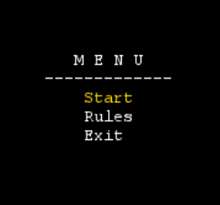
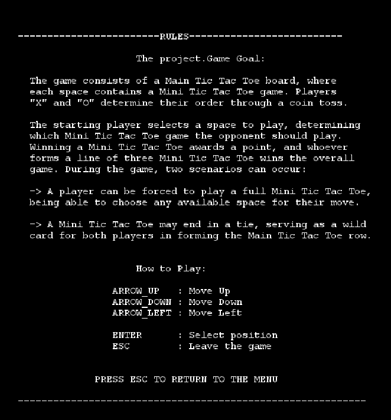
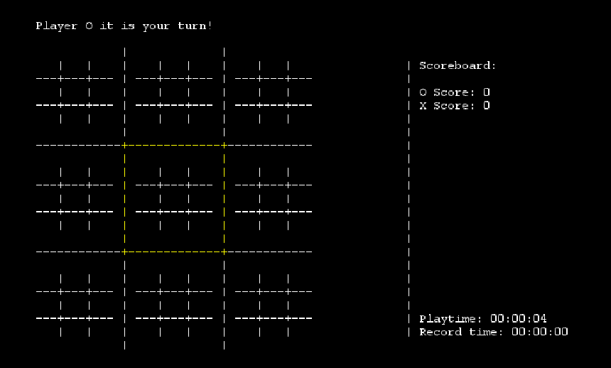

## LDTS_1203 - Tick Tock Toe
In this 2 player game we have a tic-tac-toe grid where each square has inside it a traditional game of tic-tac-toe.
At first a player chooses in which smaller tic-tac-toe square it wants to play, after that,the next player
is forced to play on the smaller game whose position on the bigger grid corresponds to the one played by the last player,
this means that if a player places its symbol on the middle square of a small tic-tac-toe then the next player
has to place his on any square from the small tick-tac-toe that it's placed at the center of the bigger grid,
when a small tic-tac-toe ends then that square in the bigger grid is considered won by the victorious symbol or as none if the smaller game ended in a tie.

Note that when a small tile is considered tie and receive no symbol it will work as a 'Joker', meaning that it can turn a point to the player
who has 2 symbols separate by this empty tile.

The game is over when one player has won 3 smaller games in adjacent positions (identically to a tradition game of tick-tac-to)
or when there aren't any more spaces to be filled.

After the game ends the players scores are updated accordingly to the result, it is shown how much time the game lasted and the time of the shortest game,
players also have the choice to keep playing in which case the game restarts.
If a player wins a match his score is increased by 1, if the game ends up tie each player earns 0.5 points.

This project was developed by Amanda Tartarotti (202211647@up.pt) Gonçalo Sousa (202207320@up.pt) and Pedro Oliveira (up202206498@up.pt) for LDTS 2023⁄24.

### IMPLEMENTED FEATURES

- **Menu** - The game provides a menu capable of starting the game, showing the rules or exiting the program.
- **Rules** - Shows on the screen a text describing the rules of the game.
- **Symbol Assigment** - Allows player 1 to decide if it wants to have the crosses or circles symbol.
- **Time** - Shows the players a clock with duration of the game and their best time.
- **Pause** - Pressing 'P' the game time is paused until new order.
- **Coin Toss** - the first player that gets to place its symbol is decided randomly.
- **Move** - A player can change the selected square either on the bigger grid or a smaller one when appropriate.
- **Select** - A player can choose to play its symbol on the square that it has selected.
- **Score** - Each player has a score that starts at 0 and is incremented by 1 if they win the bigger tic-tac-toe game.
- **Time Statistics** - When the game ends the time is stored. If it is better than the previous time a new Record Time is set.
- **Continue** - After the game the players can choose to continue playing and keep their scores.

### Full Project Report
To review the full project report [click here](docs/REPORT.md) or find in on [docs](docs) folder.

### SELF-EVALUATION

-Amanda:34%

-Gonçalo:33%

-Pedro:33%
