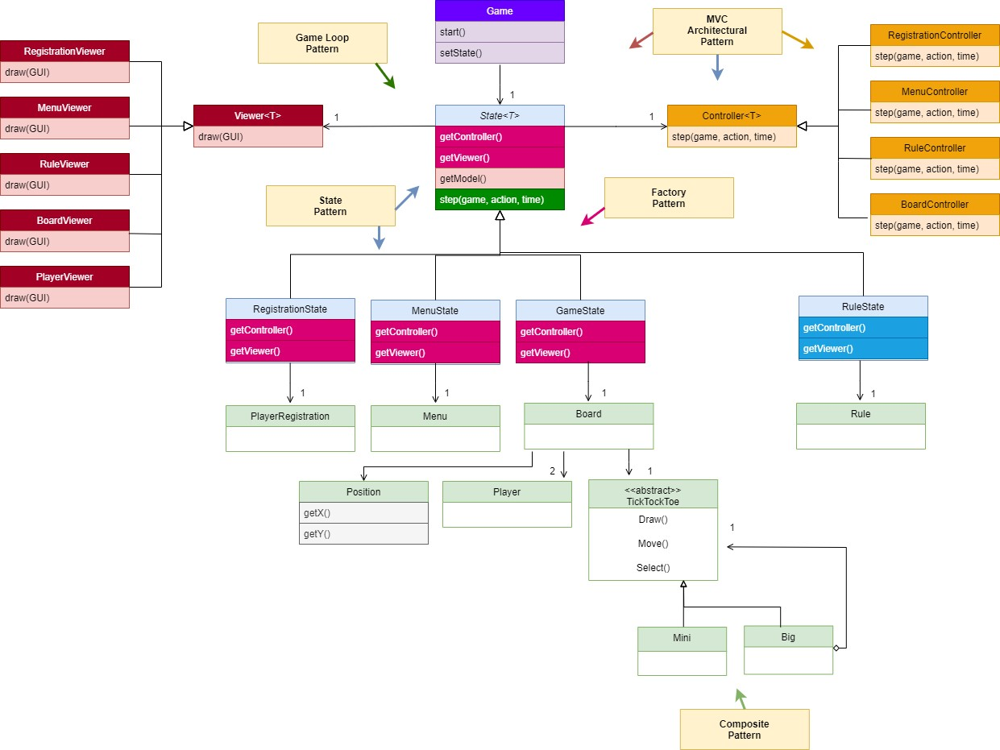
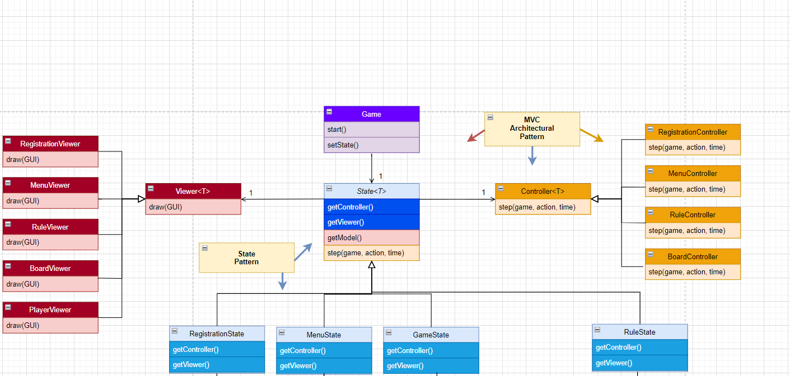
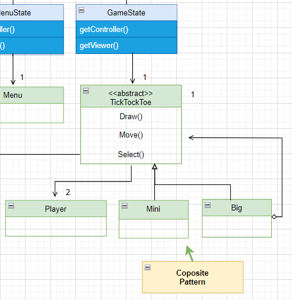
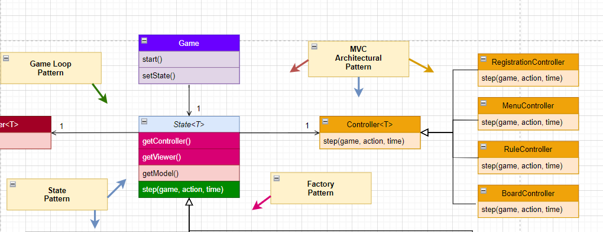
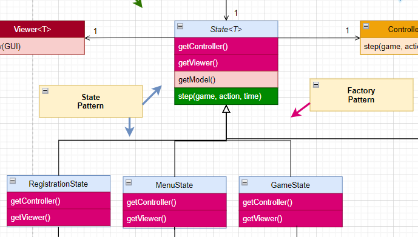
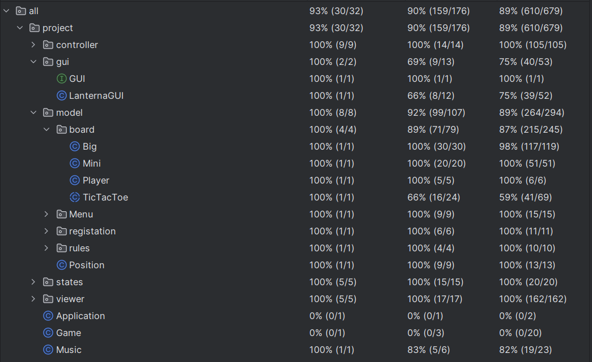
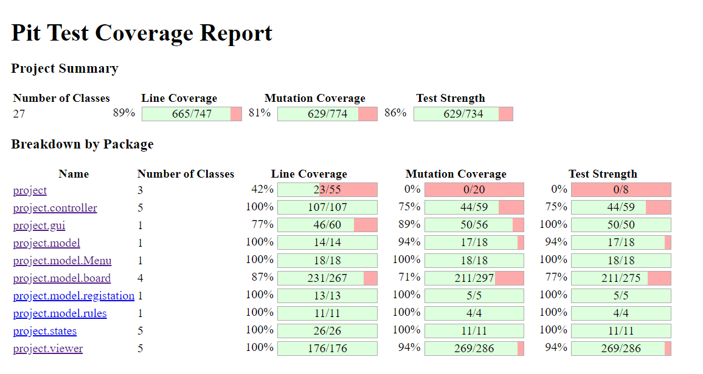

## LDTS_1203 - Tick Tock Toe

### UML

The Final version of our project has the following UML representation:

### Design

##### THE GAME NEEDS TO WRITE ON THE SCREEN, KEEP DATA AND TAKE USER INPUT

**Problem in Context**

By its very nature our game needs to show itself to the user through the screen, take user inputs and also act accordingly to said input,
while it is perfectly possible to have a single class that does this three functions said class would violate the **Single Responsibility Principle**

**The Pattern**

In order to solve this problem we have used the MVC Architectural Pattern, dividing our program into models that keep the program data,
viewers that draw on the screen and controllers that takes user inputs and uses its respective modules and viewers accordingly.

**Implementation**

The following figure shows how the pattern’s roles were mapped.

These classes can be found in the following folders:

- [Models](../src/main/java/project/model)
- [Viewers](../src/main/java/project/viewer)
- [Generic Controller](../src/main/java/project/controller)

**Consequences**

The use of the MVC Architectural Pattern in the current design allows the following benefits:
- Code readability, allowing any developer to know without doubt if the code of a class is related to data keeping, user input and visual feedback
- Respecting the **Single Responsibility Principle** by only attributing one function to a class.
- It improves scalability by simplifying the process of altering how the programme keeps data, reads input or gives visual feedback without altering other code sections.

##### THE GAME SHOULD SHOW DIFFERENT THINGS DEPENDING ON ITS STATE 

**Problem in Context**

The game should always start on the main menu however it should also be able to present the game rules as well as play the game itself,
while this could be accomplished with a variable 'state' and a conditional logic doing so would violate the **Single Responsibility Principle**
as well as the **Opened/Closed** principle since adding or removing states to our game would necessitate rewriting our code. 

**The Pattern**

We have applied the **State** pattern. This pattern allows us to represent different game states as different subclasses 
of a main class 'State', attributing said State to our class 'Game' and switching to another subclass when changing states.

**Implementation**

The following figure shows how the pattern’s roles were mapped.

These classes can be found in the following files:

- [Game](../src/main/java/project/Game.java)
- [Generic State](../src/main/java/project/states/State.java)
- [Game State](../src/main/java/project/states/GameState.java)
- [Menu State](../src/main/java/project/states/MenuState.java)
- [Registration State](../src/main/java/project/states/RegistrationState.java)
- [Rules State](../src/main/java/project/states/RulesState.java)

**Consequences**

The use of the State Pattern in the current design allows the following benefits:

- All possible states of our game are represented in a more observable way (each has its class).
- We avoided the need for a 'while' and 'switch case' in our code for class Game
- We can now change more easily add or remove states to our game.
- There are now more classes and instances to manage, but still in a reasonable number.

##### THE GAME MUST DIFFERENTIATE PLAYING ON A SMALLER OR THE LARGER TIC TACT TOE GAME

**Problem in Context**

The initial idea was to have two different states 'BigGameState' and 'MiniGameState' that would be used to distinguish when the player is
making modifications to the bigger and smaller tic-tac-toe game, however this two states would be almost identical since the stages of playing a 
game of either side are essentially the same.

This would leave us with two very similar classes which is considered malpractice in OOP

**The Pattern**

The pattern chosen to resolve this issue was the Composite pattern that defines an abstract class and defines at least 2 subclasses, one being
a regular subclass and the other being a composition of the regular one, this allows us to represent the part-whole relation
between the bigger and smaller games

**Implementation**

The following figure shows how the pattern’s roles were mapped.

These classes can be found in the following files:

- [Generic TicTacToe](../src/main/java/project/model/board/TicTacToe.java)
- [Big TicTacToe](../src/main/java/project/model/board/Big.java)
- [Mini TicTacToe](../src/main/java/project/model/board/Mini.java)

**Consequences**

- The use of the Composite Pattern allows for an easier way to represent and manipulate the code.

##### THE GAME MUST KEEP RECEIVING USER INPUTS AND ACT ACCORDINGLY WHILE IT IS RUNNING

**Problem in Context**

The programme must know when to wait for players input as well as how to respond to such input.

**The Pattern**

The Pattern chosen to solve this problem was the Game Loop Pattern that consists of a loop that will run for all the games runtime
having an iteration per user input and reacting accordingly.

**Implementation**

The following figure shows how the pattern’s roles were mapped.

These classes can be found in the following files:

- [State](../src/main/java/project/states/State.java)
- [Registration step](../src/main/java/project/controller/RegistrationController.java)
- [Menu step](../src/main/java/project/controller/MenuController.java)
- [Rules step](../src/main/java/project/controller/RuleController.java)
- [Board step](../src/main/java/project/controller/BoardController.java)

**Consequences**

- The pattern allows us to control the frame rate of the game which results in a smother experience.
- The pattern also allows us to control the game flow in a simple and more precise way.

##### DIFFERENT STATES WILL HAVE CONTROLLERS AND VIEWERS OF DIFFERENT CLASSES 

**Problem in Context**

Each state must have a function to access its controller and viewer, but for different stages
the viewer and controller will be of different classes.

**The Pattern**

The pattern chosen to solve this problem was the Factory Method Pattern, which defines an interface for creating elements
but lets the subclasses chose what classes to instantiate.

**Implementation**

The following figure shows how the pattern’s roles were mapped.

These classes can be found in the following files:

- [State](../src/main/java/project/states/State.java)
- [Registration step](../src/main/java/project/controller/RegistrationController.java)
- [Menu step](../src/main/java/project/controller/MenuController.java)
- [Rules step](../src/main/java/project/controller/RuleController.java)
- [Board step](../src/main/java/project/controller/BoardController.java)

**Consequences**

The use of the State Pattern in the current design allows the following benefits:
- The chosen pattern allows us to apply a dependency injection between a state, its controller and its viewer
by forcing it to only deal with the interface which simplifies feature implementation in our programme. 
- There are now more classes and instances to manage, but still in a reasonable number.

### KNOWN CODE SMELLS

- The way we implemented the drawing of a big and small tic-tac-toe grid requires us to draw it all white and 
after that draw on the same position again with a different color that symbolizes the square a player choose, resulting in a
repeated use of drawText function.

- Some of the methods in the 'Mini' class are only defined because the Viewer and Controller of a 'TicTacToe' must have information
as to which smaller game is being selected, the 'getSelected' function should be able to return both the bigger square that is being selected and the smaller one,
however, with the composite pattern this is not as simple since both 'Big' and 'Mini' classes share the declaration of 'getSelected' but the 'Mini' class
only returns one value while the 'Big' class should return two,
some kind of refactor is advised possibly with a new type of object that could represent this two circumstances.

### TESTING

The Coverage Tests results are as follows

And the Mutation Tests are this ones

**Pitest Note:** The pitest report could not be generated through the './gradlew pitest' command,
only being created through the 'pitest' section on the 'buil.gradle' file.

This project was developed by Amanda Tartarotti (202211647@up.pt) Gonçalo Sousa (202207320@up.pt) and Pedro Oliveira (up202206498@up.pt) for LDTS 2023⁄24.
